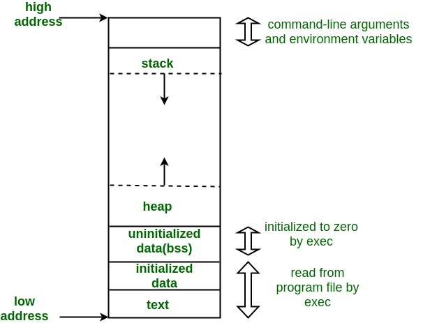

# C++ - Module 01

## Memory allocation

### 1- Static memory allocation
- **Definition:** Memory is allocated at compile-time and has a fixed size. It remains allocated for the program's entire execution.

- **Examples:** Global variables, static variables, and fixed-size arrays.
- **Key Characteristics:**
    - The size of memory must be known before the program runs.
    - The memory is automatically allocated in the **data segment**.
    - Cannot grow or shrink during runtime.

- **Example: in c++98**
```cpp
int arr[10]; // Static allocation, size is fixed at compile time.
static int count = 0; // Static variable remains in memory throughout program.
```

<br>
<div align="center">
    
    <p>source: https://www.geeksforgeeks.org/memory-layout-of-c-program/</p>
</div>

### 2- Automatic memory allocation

- **Definition:** Memory is allocated on the **stack** for local variables and function calls. It is automatically deallocated when the variable goes out of scope.

- **Key Characteristics:**
    - Managed by the compiler.
    - Memory is released automatically when the scope of the variable ends.
    - Typically faster than dynamic allocation due to its stack-based nature.

- **Example: in c++98**
```cpp
void example() {
    int x = 42; // x is automatically allocated and deallocated on the stack.
} // x goes out of scope and memory is released.

```

### 3- Dynamic memory allocation

- **Definition:** Memory is allocated at runtime from the heap, and its size can be decided dynamically. The programmer is responsible for managing its lifecycle.

- **Key Characteristics:**
    - Memory must be explicitly deallocated to avoid leaks.
    - Provides flexibility to allocate memory as needed during program execution.

- **Common Functions in C++98:**
    - `new` / `delete` for single objects.
    - `new[]` / `delete[]` for arrays.

- **Example in C++98:**
```cpp
int* ptr = new int;     // Allocate memory for a single integer.
*ptr = 5;
delete ptr;             // Free the memory.

int* arr = new int[10]; // Allocate memory for an array of 10 integers.
delete[] arr;           // Free the memory for the array.
```

## Comparison Table:
| Feature       |	Static Allocation	| Automatic Allocation  |	Dynamic Allocation      |
| ---------     | --------------------- | --------------------- | --------------------      |
| **Where**	        |   Data Segment        |	Stack	            |   Heap                    |
| **Lifetime**	    |   Program Duration    |   Scope Limited	    |   Manually Controlled     |
| **Flexibility**   |	Fixed Size	        |   Fixed Size	        |   Dynamic Size            |
| **Efficiency**    |	Very Fast	        |       Fast            |	Slower (Fragmentation)  |
| **Deallocation**   |	Implicit (By Compiler)|	Implicit (By Compiler)|	Explicit (By Programmer)|

<br>
<div align="center">
    
    <p>source: https://www.learncpp.com/cpp-tutorial/dynamic-memory-allocation-with-new-and-delete/</p>
</div>

## Pointers to members

## References

## Switch statement