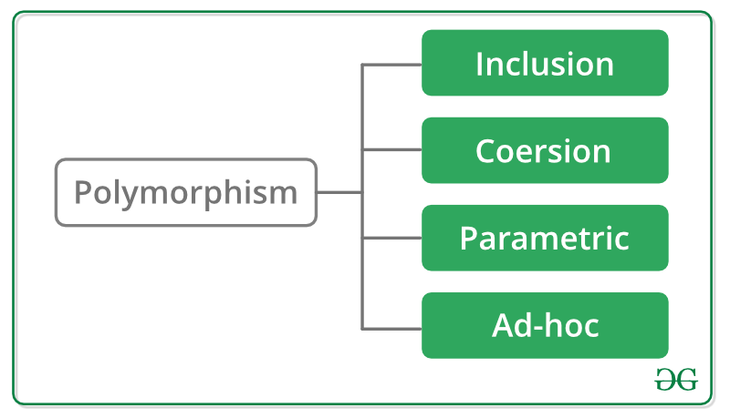

# CPP Module 02

## Orthodox Canonical class form

          ┌─ Orthodox Canonical Form: the four required member functions. ─────┐
          │                                                                    │
          └─────────────────────────> Default constructor <────────────────────┘
          │                                                                    │
          └───────────────────────────> Copy constructor <─────────────────────┘
          │                                                                    │
          └────────────────────────> Copy assignment operator <────────────────┘
          │                                                                    │
          └─────────────────────────────> Destructor <─────────────────────────┘

                   ┌──────────────────── Class Code ────────────────────┐
                   │                                                    │
      The header file: (.hpp/.h)                             the source file (.cpp)
    contains the class definition.                         contains the implementation.

# Polymorphism

Polymorphism in C++ is one of the key principles of object-oriented programming. It allows a function, method, or operator to behave differently based on the context in which it is used. In C++, polymorphism comes in two forms:

<div align="center">
    
</div>

## 1. Compile-Time Polymorphism (Static Binding):

This form of polymorphism is resolved at compile time and is achieved using:

- **Function Overloading:** Functions with the same name but different parameter lists.
- **Operator Overloading:** Customizing the behavior of operators for user-defined types.

**Example: Function Overloading**
```cpp
#include <iostream>
using namespace std;

class Calculator {
public:
    int add(int a, int b) {
        return a + b;
    }
    double add(double a, double b) {
        return a + b;
    }
};

int main() {
    Calculator calc;
    cout << calc.add(2, 3) << endl;         // Calls int version
    cout << calc.add(2.5, 3.5) << endl;     // Calls double version
    return 0;
}
```

## 2. Run-Time Polymorphism (Dynamic Binding):

This type of polymorphism is resolved at runtime and is achieved through **inheritance** and **virtual functions**. It allows for behavior to be defined in the base class but overridden in derived classes.

**Key Concepts:**
- **Virtual Functions:** Declared in the base class using the `virtual` keyword and overridden in derived classes.
- **V-Table:** A table of function pointers used to support dynamic dispatch.
- **Base Class Pointer:** Used to refer to derived class objects to invoke overridden functions.

**Example: Virtual Functions**
```cpp
#include <iostream>
using namespace std;

class Animal {
public:
    virtual void speak() {
        cout << "Animal speaks" << endl;
    }
};

class Dog : public Animal {
public:
    void speak() override {  // Override the base class function
        cout << "Dog barks" << endl;
    }
};

int main() {
    Animal* animal = new Dog();
    animal->speak();  // Calls the Dog's version of speak
    delete animal;
    return 0;
}
```

## Key Differences Between Compile-Time and Run-Time Polymorphism:

<div align="center">

| Feature   |	Compile-Time Polymorphism   |	Run-Time Polymorphism |
| --------- | ----------------------------- | ----------------------- |
| Resolution Time   |	Compile Time    |	Run Time    |
| Mechanism |	Function/Operator Overloading   |	Virtual Functions   |
| Flexibility   |	Limited |	More Flexible   |
| Overhead  |	None    |	Slight (due to V-Table) |

</div>

**There are four types of polymorphism—ad-hoc, inclusion(Subtype polymorphism), parametric, and coercion—:**

<div align="center">
    
</div>

## 1. Ad-hoc Polymorphism

- **Definition:** Ad-hoc polymorphism allows functions or operators to operate on arguments of different types, with specific implementations provided for each type. This is achieved through **function overloading** and **operator overloading**.

<br/>

- **or:** Ad-hoc polymorphism in C++ refers to the ability to define functions or operators that can operate on different types, where the behavior depends on the specific type of the arguments. It is implemented through function overloading and operator overloading.


### Function Overloading:

- **Definition:**
Function overloading in C++ is a feature that allows multiple functions to have the same name but differ in their parameter lists. The compiler determines which function to call based on the number, types, or order of arguments passed.

- **Key Rules for Function Overloading:**
1. Functions must have the same name.
2. The parameter list must differ in:
    - Number of parameters.
    - Types of parameters.
    - Order of parameters.
3. Return type cannot be used to distinguish overloaded functions.

**Examples:**

**1. Different Number of Parameters**
```cpp
#include <iostream>
using namespace std;

void display(int x) {
    cout << "Single integer: " << x << endl;
}

void display(int x, int y) {
    cout << "Two integers: " << x << " and " << y << endl;
}

int main() {
    display(10);       // Calls display(int x)
    display(10, 20);   // Calls display(int x, int y)
    return 0;
}
```

**2. Different Parameter Types**

```cpp
#include <iostream>
using namespace std;

void print(int i) {
    cout << "Integer: " << i << endl;
}

void print(double d) {
    cout << "Double: " << d << endl;
}

void print(string s) {
    cout << "String: " << s << endl;
}

int main() {
    print(10);        // Integer
    print(3.14);      // Double
    print("Hello");   // String
    return 0;
}
```

**3. Different Order of Parameters**

```cpp
#include <iostream>
using namespace std;

void print(int x, double y) {
    cout << "Integer: " << x << ", Double: " << y << endl;
}

void print(double y, int x) {
    cout << "Double: " << y << ", Integer: " << x << endl;
}

int main() {
    print(10, 3.14);   // Calls print(int x, double y)
    print(3.14, 10);   // Calls print(double y, int x)
    return 0;
}
```

#### What Function Overloading Cannot Do

**1. Overloading based only on return type:**

```cpp
int add(int a, int b);
double add(int a, int b); // Error: Ambiguous
```

**2. Differ only in default arguments:**

```cpp
void func(int x, int y = 0);
void func(int x); // Error: Ambiguous
```

### Operator overloading

**Definition:**

- Operator overloading in C++ allows you to define or redefine the behavior of operators for user-defined data types. This makes your classes work intuitively with operators like `+`, `-`, `*`, `==`, and many others, just as they do with built-in types.

**Key Points About Operator Overloading**

1. **Only existing operators can be overloaded**; you cannot create new operators.
2. **Some operators cannot be overloaded**, such as:
  - `.` (member access)
  - `::` (scope resolution)
  - `sizeof` (size determination)
  - `.*` (pointer-to-member)

3. **Syntax**: Operator overloading is done using the keyword `operator`.
4. **Operators can be overloaded as member functions or non-member (friend) functions**.

**Examples:**

**1. Overloading the `+` Operator**

```cpp
#include <iostream>
using namespace std;

class Complex {
private:
    double real, imag;
public:
    Complex(double r = 0, double i = 0) : real(r), imag(i) {}

    // Overload + operator
    Complex operator+(const Complex& other) {
        return Complex(real + other.real, imag + other.imag);
    }

    void display() const {
        cout << real << " + " << imag << "i" << endl;
    }
};

int main() {
    Complex c1(1.0, 2.0), c2(2.0, 3.0);
    Complex c3 = c1 + c2;  // Calls operator+
    c3.display();          // Outputs: 3 + 5i
    return 0;
}
```

**2. Overloading the == Operator**

```cpp
#include <iostream>
using namespace std;

class Point {
private:
    int x, y;
public:
    Point(int x, int y) : x(x), y(y) {}

    // Overload == operator
    bool operator==(const Point& other) const {
        return (x == other.x && y == other.y);
    }
};

int main() {
    Point p1(1, 2), p2(1, 2), p3(3, 4);

    cout << (p1 == p2) << endl;  // Outputs: 1 (true)
    cout << (p1 == p3) << endl;  // Outputs: 0 (false)
    return 0;
}
```

**3. Overloading the << Operator**

This is often used for custom output with `std::cout`.

```cpp
#include <iostream>
using namespace std;

class Point {
private:
    int x, y;
public:
    Point(int x, int y) : x(x), y(y) {}

    // Overload << operator (as a friend function)
    friend ostream& operator<<(ostream& os, const Point& p) {
        os << "(" << p.x << ", " << p.y << ")";
        return os;
    }
};

int main() {
    Point p(3, 4);
    cout << "Point: " << p << endl;  // Outputs: Point: (3, 4)
    return 0;
}
```

**4. Overloading the [] Operator**

This is useful for creating custom container-like classes.

```cpp
#include <iostream>
using namespace std;

class Array {
private:
    int arr[10];
public:
    Array() {
        for (int i = 0; i < 10; i++) arr[i] = i + 1;
    }

    // Overload [] operator
    int& operator[](int index) {
        if (index < 0 || index >= 10) {
            throw out_of_range("Index out of range");
        }
        return arr[index];
    }
};

int main() {
    Array a;
    cout << "Element at index 3: " << a[3] << endl; // Outputs: Element at index 3: 4
    a[3] = 42;                                     // Modifies the array
    cout << "Modified element at index 3: " << a[3] << endl; // Outputs: 42
    return 0;
}
```

#### Advantages of Operator Overloading
1. **Intuitive Syntax:** Makes custom types behave like built-in types.
2. **Improved Readability:** Code becomes easier to read and understand.
3. **Flexibility:** Customizes behavior for specific operations.

#### Important Notes
1. Overloading should maintain the intuitive meaning of the operator. For example:
- `+` should represent addition or similar behavior.
- `==` should represent equality.
2. Use **friend functions** when overloading operators that require two operands and cannot be naturally implemented as a member function (e.g., `<<` or `>>`).

Operator overloading enhances code expressiveness and functionality when used judiciously.

## 2. Inclusion Polymorphism(Subtype polymorphism)

**Definition:** Inclusion polymorphism allows objects of a derived class to be treated as objects of a base class, enabling **runtime polymorphism**. It is implemented using **inheritance** and **virtual functions**.

**Example:**
#include <iostream>
```cpp
class Base {
public:
    virtual void display() const {
        std::cout << "Base class display\n";
    }
};

class Derived : public Base {
public:
    void display() const override {
        std::cout << "Derived class display\n";
    }
};

int main() {
    Base *b = new Derived(); // Base pointer pointing to Derived object
    b->display();            // Calls Derived's display (runtime polymorphism)
    delete b;
    return 0;
}
```

## 3. Parametric Polymorphism

**Definition:** Parametric polymorphism allows a function or a class to operate on a generic type. It is implemented using **templates** in C++.

**Example 1: Function Templates**
```cpp
#include <iostream>
template <typename T>
T add(T a, T b) {
    return a + b;
}

int main() {
    std::cout << add(5, 10) << "\n";       // Works with integers
    std::cout << add(5.5, 10.5) << "\n";  // Works with doubles
    return 0;
}
```

**Example 2: Class Templates**

```cpp
#include <iostream>
template <typename T>
class Box {
    T value;
public:
    Box(T v) : value(v) {}
    T getValue() const { return value; }
};

int main() {
    Box<int> intBox(42);
    Box<std::string> strBox("Hello");
    std::cout << intBox.getValue() << "\n";
    std::cout << strBox.getValue() << "\n";
    return 0;
}
```

## 4. Coercion Polymorphism

**Definition:** Coercion polymorphism occurs when a value of one type is implicitly converted into another type. In C++, this is achieved through **type conversion** (implicit or explicit).

**Example 1: Implicit Type Conversion**

```cpp
#include <iostream>
void print(double value) {
    std::cout << "Double: " << value << "\n";
}

int main() {
    int num = 42;
    print(num); // Implicitly converts int to double
    return 0;
}
```

**Example 2: Explicit Type Conversion(Casting)**

```cpp
#include <iostream>
int main() {
    double pi = 3.14159;
    int intPi = static_cast<int>(pi); // Explicit conversion
    std::cout << "Integer: " << intPi << "\n";
    return 0;
}
```

**Summary Table:**

| Polymorphism Type	|   C++ Mechanism	|   Key Feature |
| ----------------- | ----------------- | ------------- |
| Ad-Hoc    |	Function and operator overloading   |	Compile-time    |
| Inclusion |	Virtual functions and inheritance   |	Runtime |
| Parametric    |	Templates	|   Generic coding  |
| Coercion  |	Type conversion (implicit or explicit)  |	Automatic or user-defined   |

## Floating Point numbers:

- **Accuracy** and **precision** are two concepts in measurement that nicely capture the different properties of ints and floats (on any system, independent of the particular floating point representation used). "Accuracy" refers to how close a measurement is to the true value, whereas "precision" has to do with how much information you have about a quantity, how uniquely you have it pinned down.

- **Integer** arithmetic enjoys the property of complete accuracy: if I have the integer "2", it is exactly 2, on the dot, and nobody can dispute that. Furthermore, if I add 1 to it, I know I will get exactly 3. Whatever operations I do with integers, provided there is no overflow, I will always get a number that matches the correct answer bit-for-bit. However, integers lack precision. Dividing both 5 and 4 by 2, for instance, will both yield 2. Integers are unable to keep track of the fractional part, so the information that I had a slightly bigger number than 4 (namely, 5) is lost in the process. Integers are too "chunky" to represent these finer gradations; using them is like building with bricks. If you want to make a cube, you know the bricks can represent it perfectly, but a sphere wouldn't come out quite as well (naturally, if the sphere is significantly larger than each brick, you might be able to get close enough).

- **Floating point** numbers are the exact opposite of integers with respect to accuracy and precision. They have good precision, since they never deliberately discard information representing your numbers. If you had enough bits, you could reverse any FP calculation to get the original number, just like how, with enough bits, you could represent an arbitrarily large integer. But floating point numbers have poor accuracy. If ints are like bricks, then floats might be thought of as silly putty. You have enough control to mold them into complex curved shapes, but they leave something to be desired when it comes to forming a specified target shape. Imagine trying to make a perfect cube out of silly putty—you'll never get those corners as sharp as they should be. In fact, in many cases there is literally no hope of a floating point answer's matching the correct answer bit for bit.

## Resources:

### Polymorphism:
- https://catonmat.net/cpp-polymorphism
- https://www.geeksforgeeks.org/c-plus-plus/?ref=outind
- https://www.geeksforgeeks.org/cpp-polymorphism/
- https://www.geeksforgeeks.org/operator-overloading-cpp/
- https://www.geeksforgeeks.org/ad-hoc-inclusion-parametric-coercion-polymorphisms/

### Flaot point:
- https://www.cprogramming.com/tutorial/floating_point/understanding_floating_point.html
- https://www.cprogramming.com/tutorial/floating_point/understanding_floating_point_representation.html
- https://www.youtube.com/watch?v=8afbTaA-gOQ
- https://www.youtube.com/watch?v=LXF-wcoeT0o